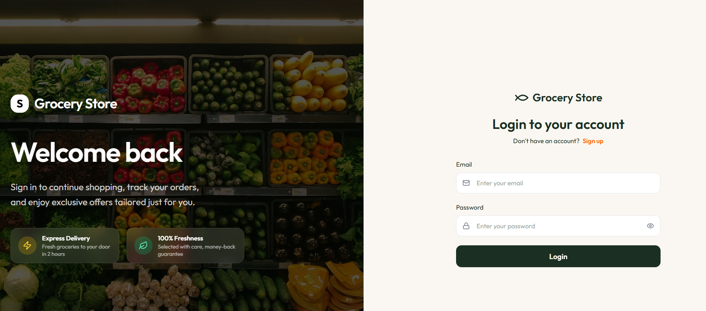
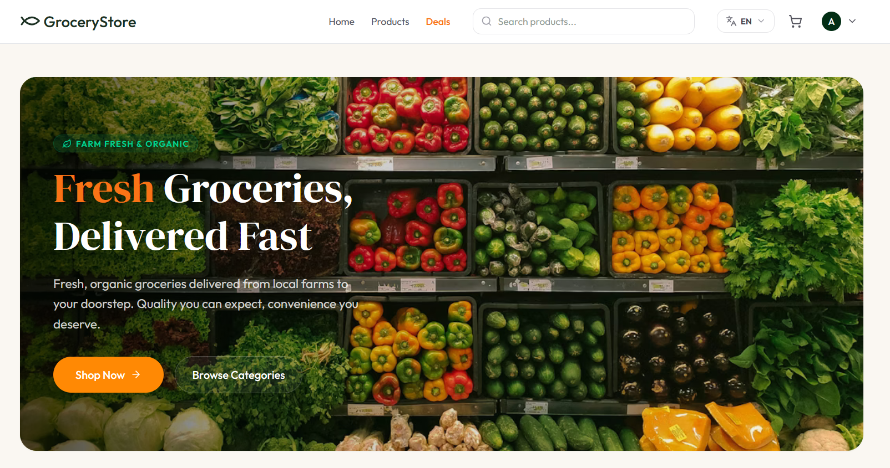
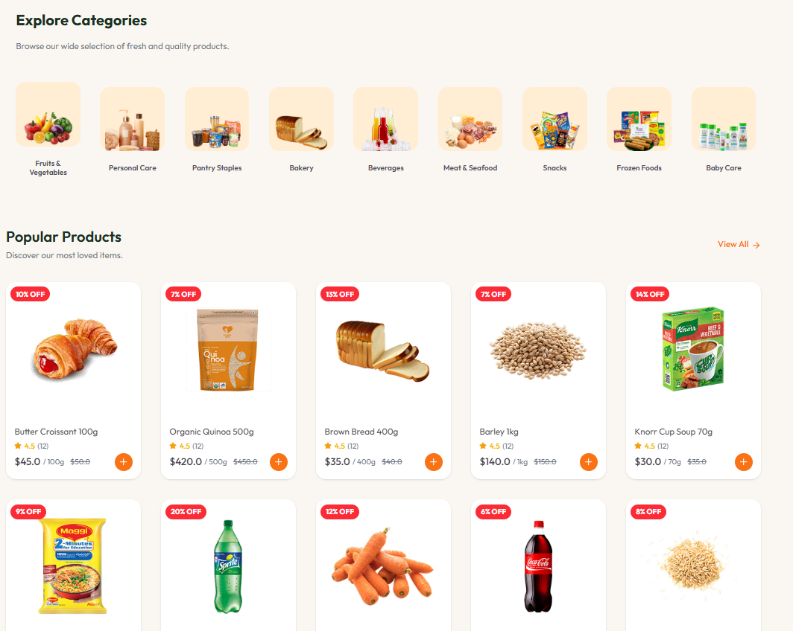
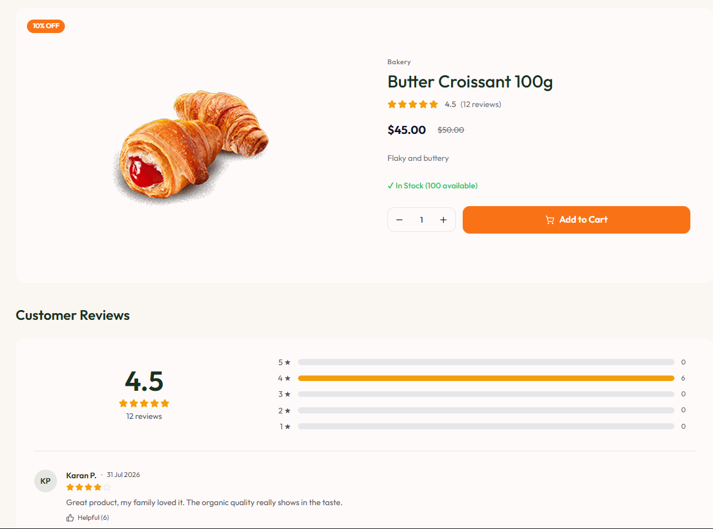
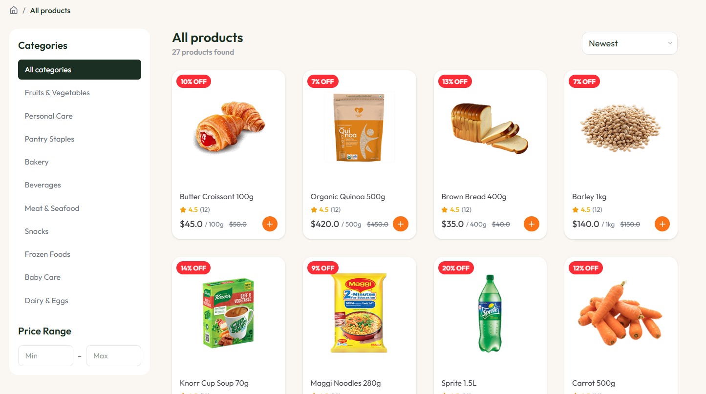
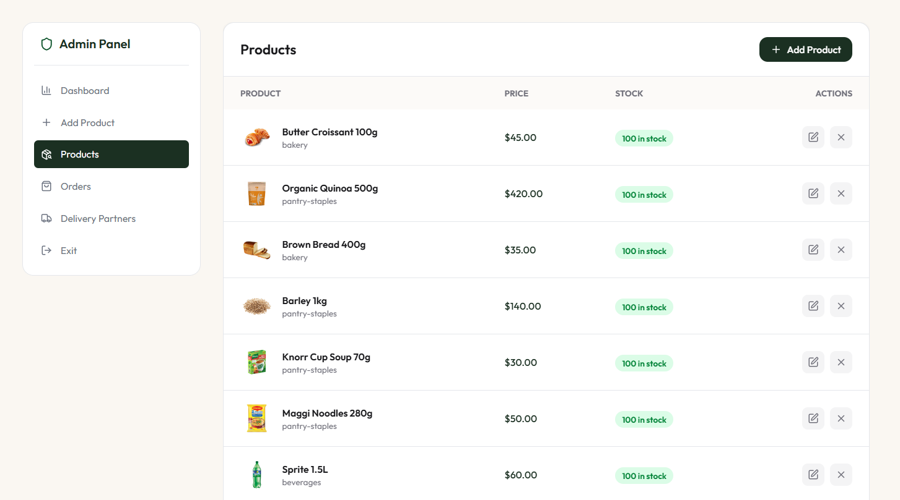

# 🛒 Fresh Grocery Store

A clean grocery e-commerce platform with a React client and a Node.js/Prisma server.

Vietnamese version: [README.vi.md](README.vi.md)

## ✨ Overview

Fresh Grocery Store is a modern grocery shopping app with a responsive client app in `client/` and a backend API in `server/`. It supports browsing products, filtering, cart management, checkout, admin tools, and delivery workflows.

## 🛠️ Tech Stack

### Client

- React + TypeScript
- Vite
- React Router
- Tailwind CSS
- React Context and hooks

### Server

- Node.js + TypeScript
- Express
- Prisma ORM
- PostgreSQL database
- Cloudinary, Nodemailer, and Inngest integrations

## ✨ Features

### Customer Features

- Browse products by category
- Search products by name
- Product details page
- Shopping cart management
- Address management
- Checkout flow
- Order history
- Responsive design for mobile, tablet, and desktop

### UI Features

- Modern grocery-themed design
- Product filtering
- Flash Deals section
- Featured products
- Category navigation
- Loading states
- Smooth animations

## 📸 Screenshots

<table>
  <tr>
    <td align="center"><strong>Login</strong><br/></td>
    <td align="center"><strong>Homepage</strong><br/></td>
    <td align="center"><strong>Content</strong><br/></td>
  </tr>
  <tr>
    <td align="center"><strong>Detail</strong><br/></td>
    <td align="center"><strong>Filter</strong><br/></td>
    <td align="center"><strong>Dashboard</strong><br/></td>
  </tr>
</table>

## 📁 Project Structure

```text
project-root/
│
├── client/                 # Frontend React Application
│   ├── public/
│   ├── src/
│   │   ├── assets/
│   │   ├── components/
│   │   ├── context/
│   │   ├── pages/
│   │   ├── types/
│   │   ├── hooks/
│   │   ├── utils/
│   │   ├── App.tsx
│   │   └── main.tsx
│   ├── package.json
│   └── vite.config.ts
│
├── server/                 # Backend API
│   ├── config/
│   ├── controllers/
│   ├── middleware/
│   ├── models/
│   ├── routes/
│   ├── uploads/
│   ├── server.js
│   └── package.json
│
├── README.md
└── .gitignore
```

## 🚀 Installation

Clone the repository:

```bash
git clone <your-repository-url>
```

Navigate to the project:

```bash
cd fresh-grocery
```

Install dependencies:

```bash
npm install
```

Start development server:

```bash
npm run dev
```

Build for production:

```bash
npm run build
```

Preview production build:

```bash
npm run preview
```

## 📸 Screenshots

### Home Page

- Hero Banner
- Categories
- Flash Deals
- Featured Products

### Product Page

- Product Information
- Add To Cart
- Related Products

### Cart

- Quantity Management
- Price Calculation
- Checkout Navigation

### Address Management

- Add Address
- Edit Address
- Default Address Selection

## 🎯 Learning Objectives

This project demonstrates:

- React Fundamentals
- TypeScript Integration
- Component Architecture
- Context API
- React Router
- State Management
- Responsive Design
- E-commerce UI Development

## 🌟 Future Improvements

- Backend API Integration
- User Authentication
- Payment Gateway
- Product Reviews
- Wishlist
- Order Tracking
- Admin Dashboard
- Real-time Notifications
